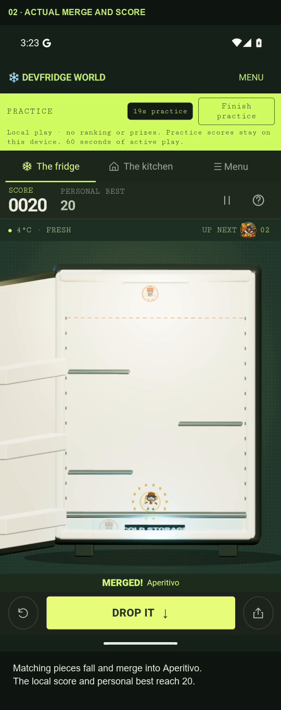
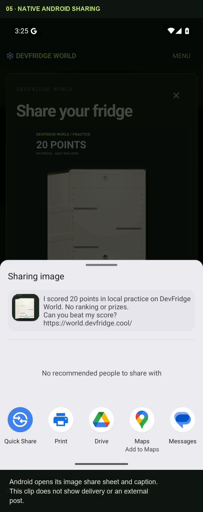
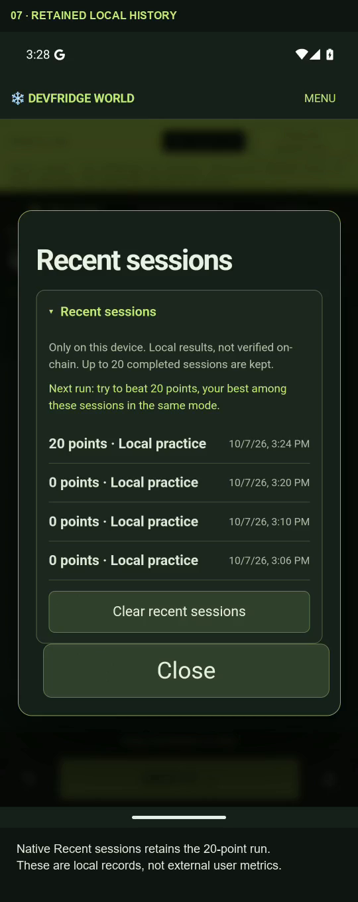

# Signed beta.2 Android local-practice evidence

[Supplemental video on YouTube](https://youtube.com/shorts/EUBxEG-gh1A) · Unlisted · English subtitles · recorded 7 October 2026.

The actual publisher-signed Android app completes a local practice run with a 20-point Aperitivo merge, displays its on-device coaching panel and score card, and opens Android's image share chooser. After a force-stop and reopen reported by the test operator, the recorded app retains personal best 20 and the completed local session. Android App info shows version `0.3.2-beta.2`.

This supplements the [earlier beta.1 Android demo](https://youtube.com/shorts/LRDAhJhFfLI). The earlier debug APK and unfunded official SDK test-wallet diagnostic remain separate evidence; their successful diagnostic signature does not establish live Phantom game access. The [earlier transcript](../../2026-10-06/android-demo.transcript.md) retains the original scope and recorded SKR failure.

## APK provenance

| Field | Recorded or separately verified value |
| --- | --- |
| Package | `cool.devfridge.world` |
| Installed version | `0.3.2-beta.2` |
| Version code | `9` |
| APK SHA-256 | `d60e046d0f4a314a2d954a8ebbfc079cdc21b54af2c6ce6fbdcf6f9e84913774` |
| Signing certificate SHA-256 | `2acabfed1ae887ed90e650a4446e5ef747de096f0fd6ea75a8948b75b06071ca` |
| APK source commit | [`f2408f43af4446bcd082c93574f14c6f24eb3af6`](https://github.com/mikeminer/devfridge-world-android/tree/f2408f43af4446bcd082c93574f14c6f24eb3af6) |
| Execution | Android 15 / API 35 emulator, DevFridgeWallet AVD |

Package metadata, the non-debuggable flag, APK hash and signing certificate were verified separately by the test operator. App info visually confirms the version name; that screen does not by itself prove the hash or signer. The operator restarted the same AVD with `-gpu host` before these recordings. Renderer configuration is not independently established by the phone UI.

## Visible evidence

| Approximate output time | Observation |
| --- | --- |
| 00:06.6 | Replay opens the actual local 3D practice game. |
| 00:21.6 | Matching pieces merge into Aperitivo; local score and personal best reach 20. |
| 00:29.4 | Practice complete shows 20 points and the on-device coaching panel. |
| 00:54.5 | The rendered share card contains the actual fridge image and 20 points. |
| 01:02.5 | Android's native image share chooser opens with the image and local-practice caption. |
| 01:07.0 | The reopened app retains personal best 20 while the current local score is zero. |
| 01:21.5 | Native Recent sessions lists the completed 20-point local run. |
| 01:31.5 | Android App info visibly shows `0.3.2-beta.2`. |

The source inputs were Android emulator input events. The video shows their game results; it is not a physical-device touch-precision or haptic measurement. Local session history is a publisher test observation, not external adoption, renewal retention or proof of other players.

## Recording and sharing scope

The 98.400-second silent video combines meaningful segments from two actual Android recordings. Source actions retain their original elapsed-time speed and the full 540 × 1200 phone frame. A 540 × 1360 output adds labels above and below that frame. Idle waits are removed with visible cut cards; conversion to 30 fps repeats or drops frames without speeding up events. No synthetic UI or secret overlays are used.

The force-stop/reopen occurred between recordings and is not recorded. A visible card explicitly states this. The following clip records the retained state after reopening.

The native share sheet contains an image thumbnail and a caption saying the score is local practice, with no ranking or prizes. No recipient app is selected. Receiving-app delivery and external social posting are not demonstrated.

Live Phantom authorization/signing, positive SKR/Aurora access, an eligible timelock-gated round, a physical Saga/Seeker or Seed Vault, haptic sensation, ranked entry and payments are outside this video. The supplemental practice result does not close those live-wallet or hardware gaps.

## Files and verification

| File | Purpose |
| --- | --- |
| [Readable transcript](android-practice-beta2.transcript.md) | Describes the silent recording, source cuts and limits. |
| [English subtitles](android-practice-beta2.en.srt) | Timed captions corresponding to the final video. |
| [Edit receipt](android-practice-beta2-edit-receipt.json) | Exact segment source/output times, hashes, speed and provenance. |
| [Visual verification](android-practice-beta2-verification.json) | Source event timestamps, privacy review, final-frame checks and limits. |
| [Publication receipt](publication.json) | Operator-reported YouTube publication and subtitle status. |
| [File hashes](SHA256SUMS.json) | Hashes and byte sizes of this evidence package. |

The original uploaded MP4 is `DevFridge-World-Beta2-Practice-Proof-2026-10-07.mp4`: 1,271,190 bytes, SHA-256 `bbda3451d3ad5bec78bc06c07c370352d9e8b3c65ea8409ee4c3c42b8552f3ae`. YouTube transcodes uploads, so that hash identifies the original MP4 rather than a streamed YouTube rendition.

Transcript, subtitles, edit/verification receipts and screenshots are byte-exact copies of the final reviewed local artifacts. The verification receipt's “local artifact only” publication field records its pre-upload QA state; [publication.json](publication.json) records the later publication. No private wallet, balance, date-of-birth or authorization logs are included here.
